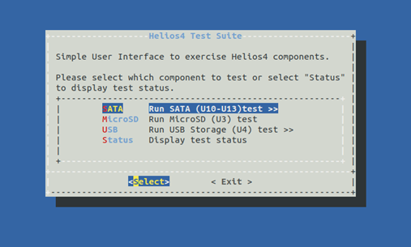
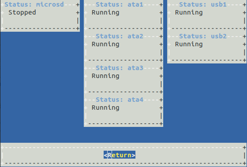
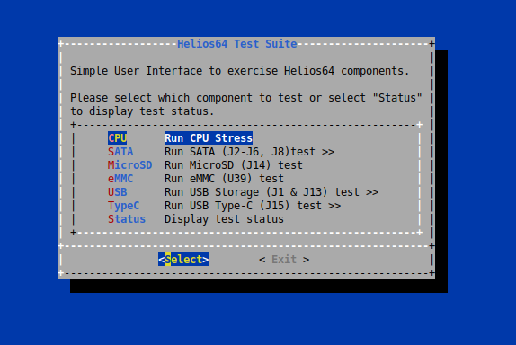
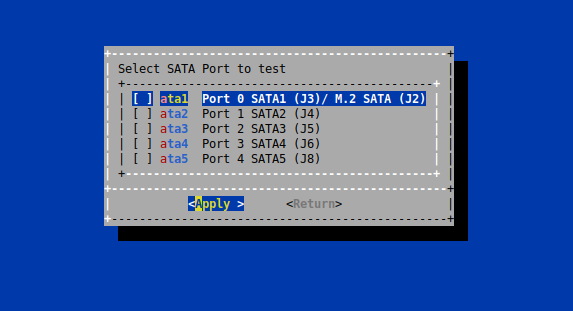
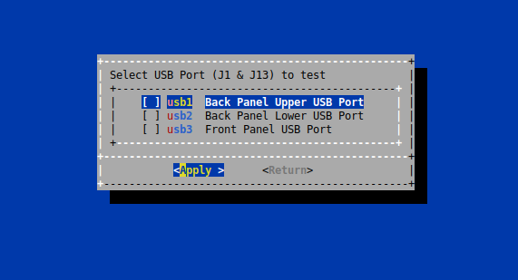
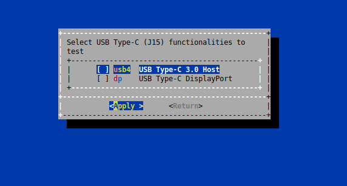
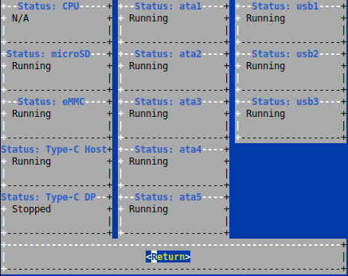

## INSTALLATION
### Helios4
Install as superuser
```
$ git clone https://github.com/kobol-io/test-suite.git
$ sudo ./install.sh -b helios4
```
### Helios64
Install as superuser
```
$ git clone https://github.com/kobol-io/test-suite.git
$ sudo ./install.sh -b helios64
```
---

The software will be installed under /usr/local/

## USAGE
### Helios4

Run helios4_test as superuser
```
$ sudo helios4_test
```

#### Display software version
```
$ sudo helios4_test -v
or
$ sudo helios4_test --version
```

##### Automatically Run All Test
```
$ sudo helios4_test -a
or
$ sudo helios4_test --all
```

### Helios64

Run helios64_test as superuser
```
$ sudo helios64_test
```

#### Display software version
```
$ sudo helios64_test -v
or
$ sudo helios64_test --version
```

##### Automatically Run All Test
```
$ sudo helios64_test -a
or
$ sudo helios64_test --all
```

## SCREENSHOT

### Helios4
#### Main menu


#### SATA submenu


#### USB submenu


#### Status


### Helios64
#### Main menu


#### SATA submenu


#### USB submenu


#### USB Type-C submenu


#### Status



